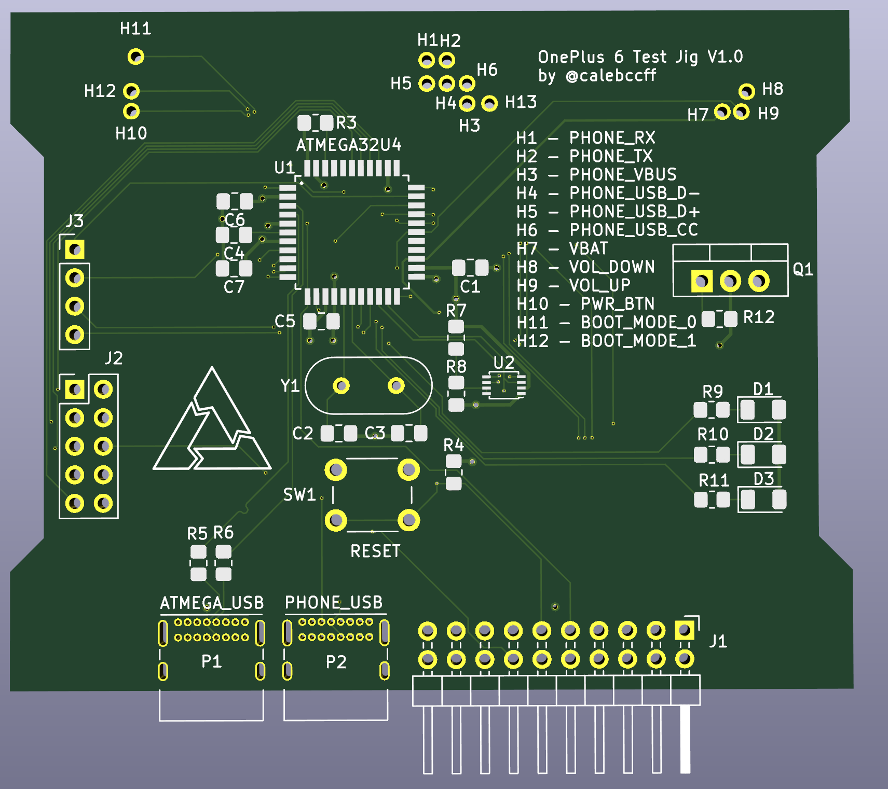

# OnePlus 6 Test Jig

The OnePlus 6 test jig is a proof of concept designed to turn the OnePlus 6 into a device which can be used in a board farm!

The jig contains holes at specific locations which line up with test points on the phone, spring loaded contact probes or "pogo pins" can then be
inserted to make contact with the pins on the phone. The PCB features an Atmega32u4 which can act as a UART<->USB adapter, an LSF0102
bidirectional logic level voltage translator to convert the UART from the 5v of the Atmega down to the 1.8v of the phone (and vice versa).

The Atmega is also used to simulate button presses on the phone, the volume and power button test pads are normally high and pressed when low.
Both of these features can be (though as yet untested) exposed via the same USB port, saving a port on the host and allowing for dirt simple 
control of the device, to test the inputs as well as perform a hard reset.

Being able to hard reset the board is a requirement for consideration in an automated board farm, this carried some complications on the OnePlus 6
as if you perform a hard reset combination (pressing volume up and power at the same time for 10 seconds) whilst VBUS (USB power) is high it will 
boot into EDL mode instead, so without a way to control VBUS the device would just be stuck in EDL. This is resolved by using a high-side FQP27P06
MOSFET.

> **NOTE:** Currently waiting for PCB shipment, expect this design to contain bugs.

## TODO

* Fix differential pair routing
* Add support for more devices by using a daughter board for the test points
* Add PHONE_USB passthrough port so that devices without USB test points can still have VBUS be controlled by the atmega
